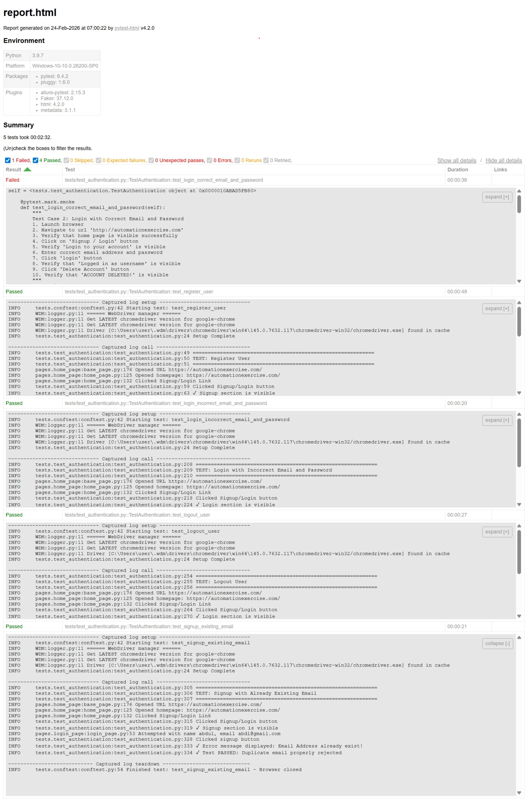

# AutomationExercise Selenium Python Framework

Automation testing framework built using **Python**, **Selenium WebDriver**, and **pytest** to automate end-to-end test scenarios on the AutomationExercise website.
This project demonstrates implementation of a **maintainable QA automation framework** using industry best practices such as Page Object Model (POM), reusable utilities, and structured test architecture.

---

## Project Overview

This project was developed as a **QA Automation portfolio project** to simulate a real-world automation framework used by QA Engineers.

The framework automates core authentication workflows including:

- User Registration
- Login (valid & invalid scenarios)
- Logout functionality
- Registration validation for existing users

The goal of this project is to demonstrate:

- UI automation using Selenium
- Test framework design
- Clean and scalable test architecture
- Reusable automation components

---

## Tech Stack

- **Python** 3.9.7
- **Selenium** 4.36.0
- **pytest** 8.4.2
- **pytest-html** 4.2.0
- **pytest-metadata** 3.1.1
- Faker (test data generation)
- Chrome WebDriver (auto-managed)

---

## Framework Architecture

The framework follows the **Page Object Model (POM)** design pattern to separate test logic from page interaction logic.

```
automationexercise-selenium-python
│
├── logs/
│
├── pages/
│   ├── basepage.py
│   ├── homepage.py
│   ├── loginpage.py
│   └── signup.py
│
├── reports/
│   ├── html_reports/
│   └── screenshot/
│
├── tests/
│   ├── conftest.py
│   └── test_authentication.py
│
├── utils/
│   ├── config.py
│   ├── driver_factory.py
│   └── data_generator.py
│
├── pytest.ini
├── requirements.txt
└── .gitignore
```

---

## Key Features

✅ Page Object Model (POM) implementation
✅ Reusable BasePage utilities
✅ Explicit wait handling
✅ Driver Factory pattern
✅ Config-based environment settings
✅ Faker-based dynamic test data generation
✅ HTML test reporting
✅ Logging system
✅ Headless browser execution option
✅ Screenshot capability (framework-ready)

---

## Automated Test Scenarios

Implemented automation test cases:

1. Register User
2. Login User with correct email and password
3. Login User with incorrect email and password
4. Logout User
5. Register User with existing email validation

---

## Installation & Setup

### Clone Repository

```bash
git clone https://github.com/abdlgoni/automationexercise-selenium-python.git
cd automationexercise-selenium-python
```

### Create Virtual Environment

```bash
python -m venv venv
```

Activate environment:

**Windows**

```bash
venv\Scripts\activate
```

**Mac/Linux**

```bash
source venv/bin/activate
```

### Install Dependencies

```bash
pip install -r requirements.txt
```

---

## Running Tests

Run all tests:

```bash
pytest tests -v
```

Run with HTML report:

```bash
pytest --html=reports/html_reports/report.html
```

Run in headless mode:

```bash
pytest --headless
```

---

## Test Reporting

After execution, HTML reports will be generated inside:

```
reports/html_reports/
```

Logs are stored in:

```
logs/
```

---

## Sample Test Report



## Automatic Screenshot on Failure


## Framework Design Highlights

### Page Object Model (POM)

Each web page is represented as a class containing locators and reusable actions, improving maintainability and readability.

### BasePage Utilities

Common browser actions such as waits, interactions, and screenshots are centralized to avoid duplication.

### Driver Factory

Browser initialization is handled through a factory pattern allowing easy configuration and scalability.

### Data Generator

Dynamic test data is created using Faker to avoid dependency on static test data.

---

## Future Improvements

- Automatic screenshot capture on test failure
- Parallel test execution
- Expanded test coverage (Cart & Checkout flow)
- Test data management enhancement

---

## Author

QA Automation portfolio project created to demonstrate practical automation testing skills using Selenium and Python.

Manual Testing: https://github.com/abdlgoni/qa-portfolio-sauce-demo

---

## License

This project is for educational and portfolio purposes.
